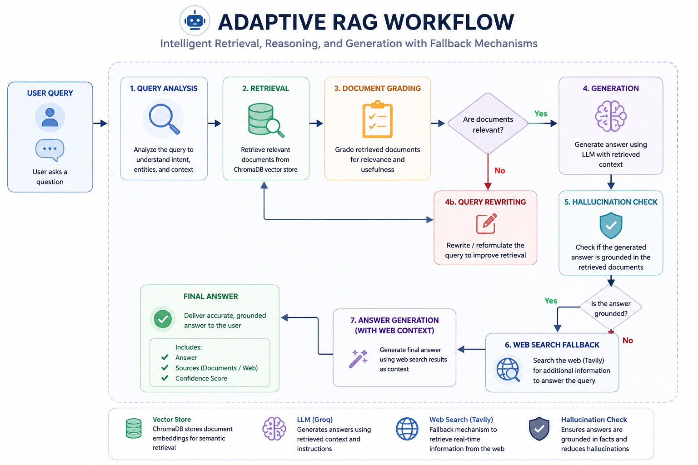
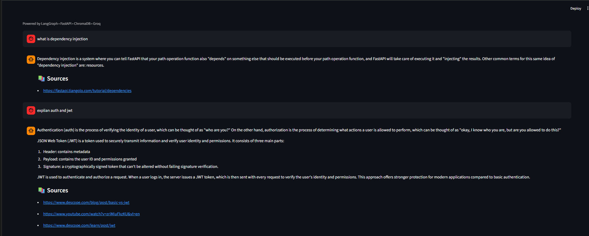

# Express Analytics – Adaptive RAG Assistant

An **Adaptive Retrieval-Augmented Generation (Adaptive RAG)** system developed as part of the **Express Analytics AI/ML Engineer Internship Assignment**.

The project combines **FastAPI**, **LangGraph**, **ChromaDB**, **Groq LLM**, and **Tavily Search** to build an intelligent documentation assistant capable of retrieving relevant information, rewriting ambiguous queries, detecting hallucinations, and performing web search fallback when required.

---

# 🚀 Features

- Adaptive RAG workflow using LangGraph
- Documentation ingestion from any website
- Semantic search using ChromaDB
- Query analysis and routing
- Document relevance grading
- Query rewriting
- Hallucination detection
- Web search fallback using Tavily
- REST APIs built with FastAPI
- Interactive Streamlit frontend
- Source citation support
- User feedback collection

---

# 🏗️ Document Ingestion Pipeline

The document ingestion pipeline converts raw documentation into a searchable vector knowledge base.

The pipeline performs the following steps:

- Crawl documentation URLs
- Load webpage contents
- Split documents into semantic chunks
- Generate vector embeddings
- Store embeddings in ChromaDB

<p align="center">
    
</p>

<p align="center">
<i>Figure 1. End-to-end document ingestion pipeline.</i>
</p>

---

# 🧠 Adaptive RAG Workflow

Once the documentation has been indexed, every incoming query passes through an Adaptive RAG workflow implemented using LangGraph.

Instead of following a fixed retrieval pipeline, the system dynamically determines whether it should:

- Retrieve documents
- Rewrite the user query
- Generate an answer
- Verify answer grounding
- Perform web search if additional context is required

This adaptive decision-making significantly improves answer quality while reducing hallucinations.

<p align="center">
    
</p>

<p align="center">
<i>Figure 2. Adaptive RAG workflow.</i>
</p>

---

# 💻 Streamlit User Interface

The frontend is developed using **Streamlit**, providing an intuitive interface for interacting with the assistant.

Users can:

- Ask documentation-related questions
- Receive grounded responses
- View retrieved sources
- Interact with the assistant in real time

<p align="center">
    
</p>

<p align="center">
<i>Figure 3. Streamlit user interface.</i>
</p>

---

# ⚙️ REST API

The backend exposes four REST endpoints.

| Method | Endpoint | Description |
|---------|----------|-------------|
| POST | `/ingest` | Crawl and ingest documentation |
| POST | `/query` | Execute the Adaptive RAG workflow |
| GET | `/documents` | List indexed documentation |
| POST | `/feedback` | Store user feedback |

---

# 📥 Document Ingestion Endpoint

The `/ingest` endpoint crawls documentation from the provided URL, creates embeddings, and stores them in ChromaDB.

<p align="center">
    
</p>

<p align="center">
<i>Figure 4. Successful document ingestion.</i>
</p>

---

# 💬 Query Endpoint

The `/query` endpoint executes the complete Adaptive RAG workflow and returns grounded responses along with supporting sources.

<p align="center">
    
</p>

<p align="center">
<i>Figure 5. Query endpoint response.</i>
</p>

---

# 📚 Documents Endpoint

The `/documents` endpoint lists every documentation source currently indexed inside ChromaDB.

<p align="center">
    
</p>

<p align="center">
<i>Figure 6. Indexed documentation sources.</i>
</p>

---

# ⭐ Feedback Endpoint

The `/feedback` endpoint enables users to submit feedback about generated responses.

The submitted feedback is stored in a JSON file, making it easy to analyze user responses and improve the system over time.

<p align="center">
    
</p>

<p align="center">
<i>Figure 7. Feedback endpoint storing user feedback.</i>
</p>

---

# 📂 Project Structure

```text
express-analytics-fastapi-rag/
│
├── app/
│   ├── api/
│   ├── frontend/
│   ├── graph/
│   ├── ingestion/
│   ├── llm/
│   ├── retrieval/
│   └── search/
│
├── images/
│   ├── UI.png
│   ├── documents endpoint.png
│   ├── feedback endpoint_josnfile.png
│   ├── ingest endpoint.png
│   ├── ingestion pipeline.png
│   ├── langgraph_rag_workflow.png
│   └── query endpoint.png
│
├── test/
├── README.md
├── requirements.txt
├── .gitignore
├── .env.example
└── main.py
```

---

# 🛠️ Tech Stack

| Category | Technology |
|----------|------------|
| Backend | FastAPI |
| Frontend | Streamlit |
| Workflow Engine | LangGraph |
| LLM | Groq |
| Vector Database | ChromaDB |
| Web Search | Tavily Search |
| Embeddings | HuggingFace Embeddings |
| HTML Parsing | BeautifulSoup |
| Validation | Pydantic |

---

# 📦 Installation

## Clone the repository

```bash
git clone https://github.com/AnuvratSharma9/express-analytics-fastapi-rag.git

cd express-analytics-fastapi-rag
```

---

## Install dependencies

```bash
pip install -r requirements.txt
```

---

## Configure Environment Variables

Create a `.env` file.

```env
GROQ_API_KEY=your_groq_api_key
TAVILY_API_KEY=your_tavily_api_key
```

---

## Run FastAPI

```bash
uvicorn main:app --reload
```

Open Swagger UI:

```
http://127.0.0.1:8000/docs
```

---

## Run Streamlit

```bash
streamlit run app/frontend/app.py
```

---

# 🔄 Adaptive RAG Execution Flow

```text
User Query
     │
     ▼
Query Analysis
     │
     ▼
Retrieve Documents
     │
     ▼
Grade Documents
     │
 ┌───┴─────────────┐
 │                 │
 ▼                 ▼
Generate      Rewrite Query
 │                 │
 ▼                 │
Hallucination Check│
 │                 │
 ├────Grounded────►END
 │
 ▼
Web Search
 │
 ▼
Generate Final Answer
 │
 ▼
END
```

---

# 🔮 Future Improvements

- Hybrid Retrieval (BM25 + Dense Retrieval)
- Incremental indexing
- Persistent feedback database
- Authentication & authorization
- Conversation memory
- Docker support
- Kubernetes deployment
- CI/CD integration

---

# 👨‍💻 Author

**Anuvrat Sharma**

AI/ML Engineer • Python • FastAPI • LangGraph • LLMs • Retrieval-Augmented Generation
